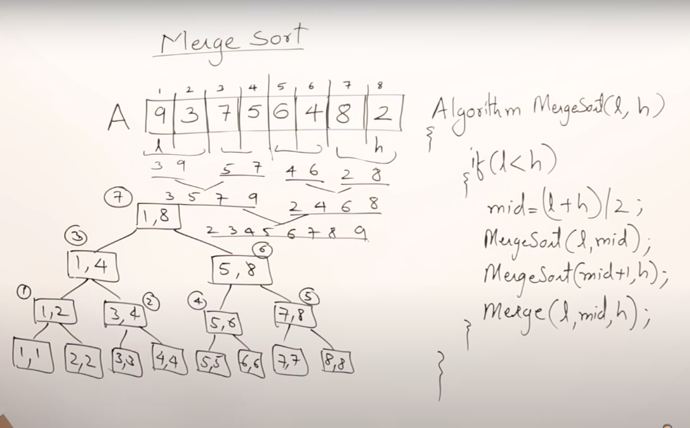
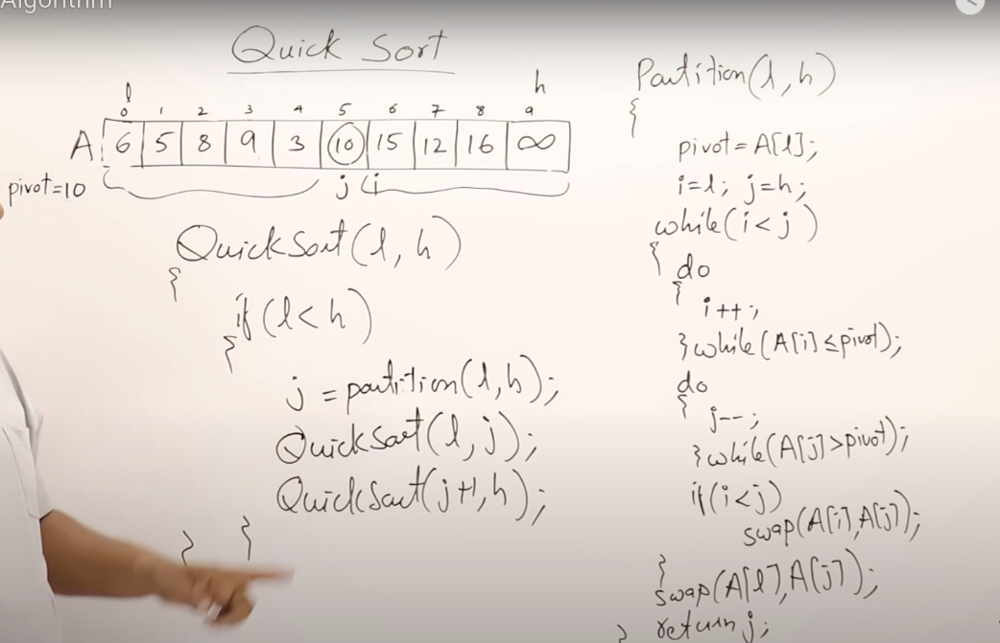

# Merge Sort
+ Divide and Conqueror Method
+ Until we have a array of size 1(sorted by itself) we partition the array
+ Call mergesort of `left-arr`
+ Call mergesort of `right-arr`
+ after receiving the sorted-left-arr and sorted-right-arr, we perform `2-way-merge`
+ TIME COMPLEXITY : `O(nlogn)`
+ INITIAL ARRAY: [9, 3, 7, 5, 6, 4, 8, 2]
  


```py
def twoWayMerge(l,r):
    arr = [0]*(len(l) + len(r) )

    i = j = k = 0
    while i < len(l) and j < len(r) :

        if l[i] <= r[j]:
            arr[k] = l[i]
            i += 1
        else:
            arr[k] = r[j]
            j += 1

        k += 1

    while i < len(l) :
        arr[k] = l[i]
        i += 1
        k += 1

    while j < len(r) :
        arr[k] = r[j]
        j += 1
        k += 1

    return arr

def mergeSort(low, high, arr):
    mid = (low+high)//2

    l = mergeSort(low, mid, arr)
    r = mergeSort(mid+1, high, arr)

    return twoWayMerge(l,r)
```


# Quick Sort
+ Divide and Conqueror Method
+ Selects a `pivot` position , here starting of list
+ places it in `correct position`
+ calls quick sort for `left-arr`
+ calls quick sort for `right-arr`
+ TIME COMPLEXITY : `O(n*n)`
  


```py
def partition(low,high,arr):
    pivot = arr[low]
    i = low
    j = high
    while i < j:
        while i<j and arr[i] <= pivot:
            i += 1
        while j>i and arr[j] > pivot:
            j -= 1
        if i < j:
            arr[i],arr[j] = arr[j],arr[i]
            i += 1
            j -= 1
    arr[low],arr[j] = arr[j],arr[low]


def quicksort(low,high,arr):

    while low < high :
        pos = partition(low,high,arr)
        quicksort(low,pos)
        quicksort(pos+1,high)
    return arr
```