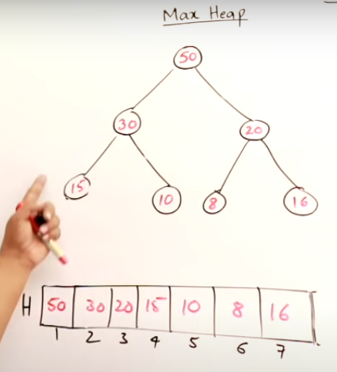

# Heap
+ Data structure that is used for giving next_min element or next_maximum element in the heap queue
+ It is a `complete binary tree`:
  + If we order them in level wise in a list there wont be a empty space , meaning all the nodes are filled in correct order.
  + If the height of the binary tree is `h`, then its a `FULL` binary tree of height `h-1` and the last level nodes are placed in correct order
---
# Binary Tree Property
+ If the we consider `0` based indexing
+ Consider a node is at `i`th position
+ Its child will be in `2*i+1`th and `2*i+2` th positions.
+ Its parent will be at `i//2`th position
+ Height of the tree will always be `log n` where n is the number of elements

## Min heap
+ Minimum element will be at the root
+ All the descendants of any node will be always be `greater than equal <=` to the node
+ Used for finding the 
  + `Most frequent element`
  + `Maximum sum elements`

+ Popping all the elements and storing them in last position will give us the `DE-SORTED` array
## Max heap
+ Maximum element will be at the root
+ All the descendants of any node will be always be `less than equal <=` to the node
+ Used for finding the 
  + `Least frequent element`
  + `Minimum sum of elements`
+ Popping all the elements and storing them in last position will give us the `SORTED` array
---
# Internal Working

+ While inserting a new element into the heap we need to main the properties of the heap (i.e)
  + `Complete Binary tree`
  + `MIN or MAX` with parent node property

## Insertion Steps
1. Insert the node at the last position
2. Compare it with its parent and check whether it hold the property(`min heap` or `max heap` ).
3. If yes do nothing
4. Else swap the nodes
5. Repeat the step `2` until we maintain the heap property or we reach the root node.
6. Insertion goes from bottom to top by swapping elements if the heap property is not satisfied
7. It at most takes `log n` time complexity

+ Example of max heap insertion
+ INPUT: `60`
+ BEFORE INSERTION

+ AFTER INSERTION


## Deletion Steps
1. Remove the root node
2. Place the last node of the heap into the root
3. Check whether it hold the property(`min heap` or `max heap` ) with its children.
4. If yes do nothing
5. Else swap the nodes
6. Repeat the step `3` until we maintain the heap property or we reach the root node.
+ Before Deletion

+ Step 2 of placing last node as root

+ Compare with its children swap if required and repeat steps

+ Final max heap after deletion


## Heap sort Steps
+ `KEY IDEA` If we delete all the elements and place them in the last possible position we get the sorted array

1. Insert all the elements into the heap
2. Delete all the elements one by one
3. Store the deleted element in the last possible heap position


+ Time complexity: `O( 2* nlogn)` -> `O(nlogn)`


## Heapify Steps
+ `KEY POINT:` Instead of inserting element one by one we can do `heapify` which takes only `O(n)` complexity

1. Take last node and check whether it hold the heap property
2. If `Yes continue` going left and repeat operations
3. If `No swap` it with the corresponding `child` and repeat steps for both the swapped child and parent node to maintain the property
+ Before Heapify

+ Swapped the nodes `15` and `25`

+ Swapped the nodes `20` and `40`

+ Swapped the nodes `10` and `40`
+ Swapped the nodes `10` and `20`


# Priority Queue( C++ ) or Heapq in (Python)
+ Its a data structure which uses this heap property
+ `KEY NOTE`: Normal queue where we want elements based on priority will take higher time complexity as either `insertion` or `deletion` will take `O(n)` time, that is why we use this heap property.
+ Elements are stored based on the priority where the elements value itself is its priority.
+ Then they are taken out based on the highest priority element
+ There are 2 ways
  + `Lower the value Higher the priority` -> `MIN HEAP`
  + `Higher the value Higher the priority` -> `MAX HEAP`


# PYTHON CODE FOR IMPLEMENTING HEAPQ

## HEAPPUSH
```py
def heappush(heap, item):
    """Push item onto heap, maintaining the heap invariant."""
    heap.append(item)
    _siftdown(heap, 0, len(heap)-1)
```
## HEAPPOP
```py
def heappop(heap):
    """Pop the smallest item off the heap, maintaining the heap invariant."""
    lastelt = heap.pop()    # raises appropriate IndexError if heap is empty
    if heap:
        returnitem = heap[0]
        heap[0] = lastelt
        _siftup(heap, 0)
        return returnitem
    return lastelt
```
## SHIFTDOWN
```py
# 'heap' is a heap at all indices >= startpos, except possibly for pos.  pos
# is the index of a leaf with a possibly out-of-order value.  Restore the
# heap invariant.
def _siftdown(heap, startpos, pos):
    newitem = heap[pos]
    # Follow the path to the root, moving parents down until finding a place
    # newitem fits.
    while pos > startpos:
        parentpos = (pos - 1) >> 1
        parent = heap[parentpos]
        if newitem < parent:
            heap[pos] = parent
            pos = parentpos
            continue
        break
    heap[pos] = newitem
```
## SHIFTUP
```py
def _siftup(heap, pos):
    endpos = len(heap)
    startpos = pos
    newitem = heap[pos]
    # Bubble up the smaller child until hitting a leaf.
    childpos = 2*pos + 1    # leftmost child position
    while childpos < endpos:
        # Set childpos to index of smaller child.
        rightpos = childpos + 1
        if rightpos < endpos and not heap[childpos] < heap[rightpos]:
            childpos = rightpos
        # Move the smaller child up.
        heap[pos] = heap[childpos]
        pos = childpos
        childpos = 2*pos + 1
    # The leaf at pos is empty now.  Put newitem there, and bubble it up
    # to its final resting place (by sifting its parents down).
    heap[pos] = newitem
    _siftdown(heap, startpos, pos)
```

## HEAPIFY
```py
# Transform bottom-up.  The largest index there's any point to looking at
    # is the largest with a child index in-range, so must have 2*i + 1 < n,
    # or i < (n-1)/2.  If n is even = 2*j, this is (2*j-1)/2 = j-1/2 so
    # j-1 is the largest, which is n//2 - 1.  If n is odd = 2*j+1, this is
    # (2*j+1-1)/2 = j so j-1 is the largest, and that's again n//2-1.
def heapify(x):
    """Transform list into a heap, in-place, in O(len(x)) time."""
    n = len(x)
    for i in reversed(range(n//2)):
        _siftup(x, i)
```